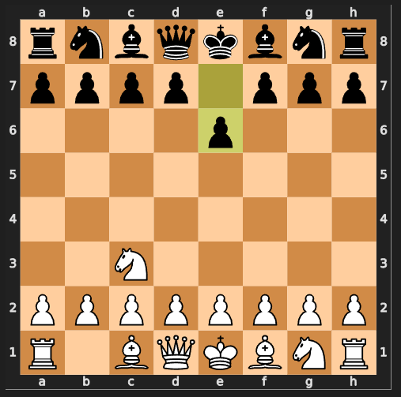

### AI Chess player
##

The Simple AI Chess Player is a Python program that allows users to play chess against an artificial intelligence opponent. The AI opponent, provides an engaging and interactive experience by selecting moves based on the score of the position after the move. Players can choose the model to play against the computer (which selects the move randomly) or against human player. The program utilizes the python-chess library for chess board representation and move generation.

- AI vs Random pick.ipynb contains code for AI vs computer (Random choice selector)
- game.ipynb contains code for AI vs Human game

## Steps to run the program on Windows
1. Create a virtual environment 
```
python -m venv "environment name"
```
2. Activate the virtual environment
```
"environment name"\Scripts\activate
```
3. Install all required libraries
```
pip install -r requirements.txt
```
4. Run the program
```
open the ipynb file and run the cell
```


